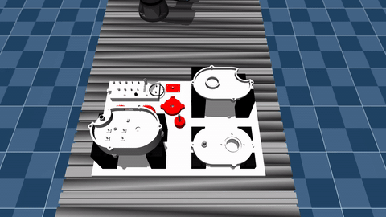
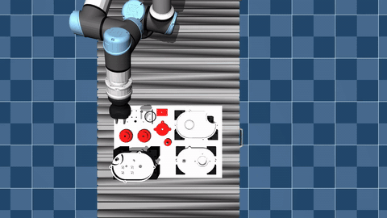

# LABIT: Long-Horizon Robotic Assembly Benchmark for Industrial Tasks

<table width="100%">
  <tr>
    <td width="50%" align="center">
      <h3></h3>
      
    </td>
    <td width="50%" align="center">
      <h3></h3>
      
    </td>
  </tr>
</table>

The LABIT benchmark provides a comprehensive evaluation framework for robotic assembly and insertion operations. This simulation framework implements the full LABIT benchmark within MuJoCo, enabling scalable evaluation of robotic insertion task performance.

### Benchmark Overview

LABIT is designed to evaluate robotic systems on realistic assembly tasks with varying complexity levels. The benchmark includes:

- **Base Parts**: A standardized set of mechanical components representing real assembly scenarios
- **Task Variants**: Multiple insertion tasks with different difficulty levels and geometric constraints
- **Performance Metrics**: Quality-aware metrics that go beyond simple success/failure evaluation

### Quality-Aware Performance Metrics

The framework implements a comprehensive taxonomy of assembly complexity and corresponding evaluation protocols:

- **Taxonomy of Assembly Complexity**: Tasks are categorized by geometric difficulty, requiring different levels of precision and force control
- **Evaluation Protocol**: Standardized procedures for consistent and reproducible benchmarking across different robotic systems
- **Quality Metrics**: Measures including insertion force profiles, contact forces, and geometric alignment to assess task execution quality

### Simulation Environment

The LABIT benchmark simulation is built on:

- **Physics Engine**: MuJoCo for accurate contact dynamics and force simulation
- **Scene Configuration**: Pre-configured scenes with benchmark-standard object meshes and collision geometry
- **Randomization**: Support for randomized sphere-based surface representations to simulate surface variations and roughness

### Running Benchmark Evaluations

Configuration files for the LABIT benchmark are provided in:
- `configs/envs/ur5e_labit_benchmark.yaml` - Environment configuration
- `configs/robots/ur5e.yaml` - Robot configuration

Pre-processed benchmark objects are available in `assets/task_env/labit_benchmark/` including part meshes, collision models, and sphere-based decompositions.

### Trouble shooting
If you dont have a nvidia gpu, comment out the corresponding lines in the docker-compose.yml

If  the mujoco GUI doesnt show up on your display, check your DISPLAY environment variable and try:
> xhost +local:docker

